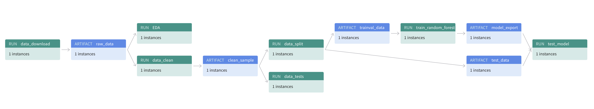
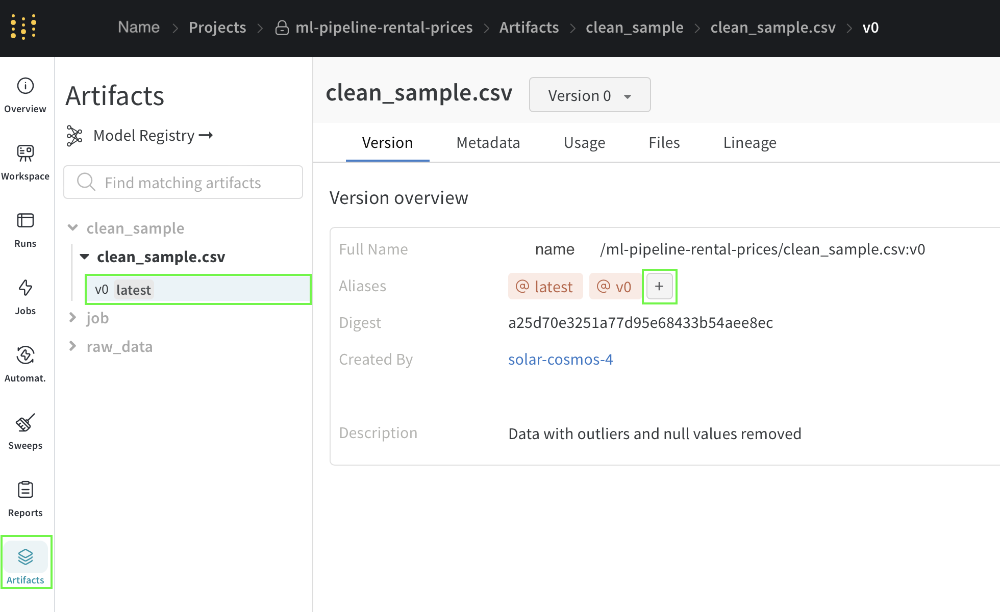
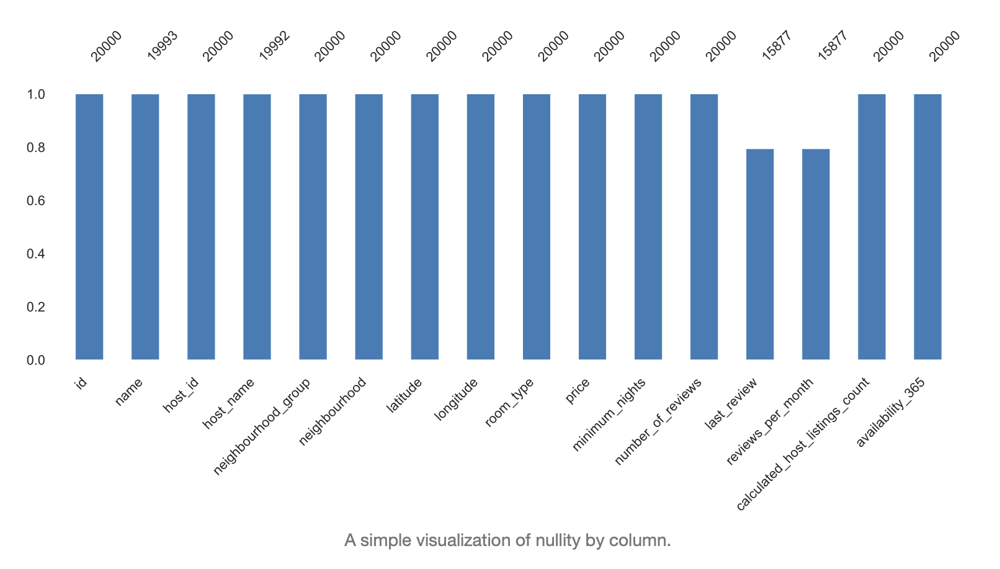
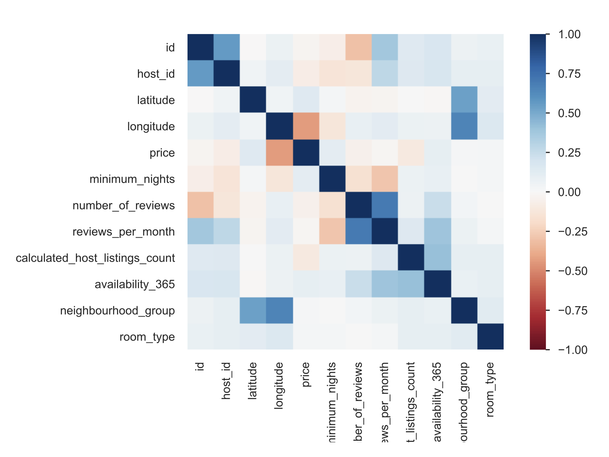
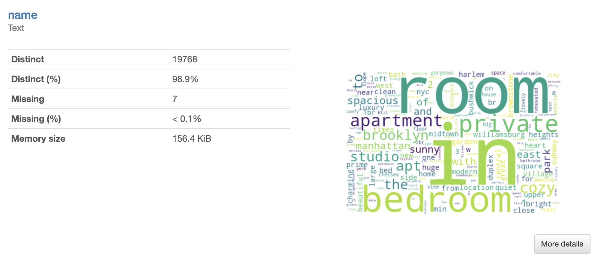
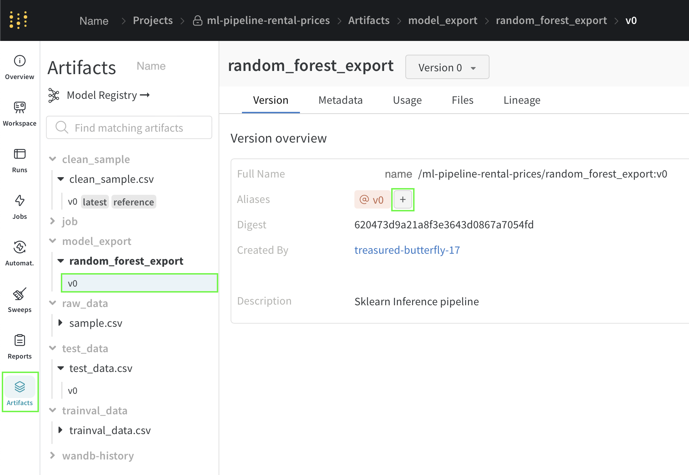

<a name="readme-top"></a>


# ML Pipeline for Predicting Short-Term Rental Prices [](https://www.paypal.com/cgi-bin/webscr?cmd=_s-xclick&hosted_button_id=EFQXNQ7UYXYKW&source=url)

<div align='left'>

[](https://mlflow.org)
[](https://wandb.ai)

</div>

<details>
  <summary>Table of Contents</summary>
  <ol>
    <li>
      <a href="#project-description">Project description</a>
    </li>
    <li>
      <a href="#files-and-data-description">Files and data description</a>
    </li>
    <li>
      <a href="#getting-started">Getting Started</a>
      <ul>
        <li><a href="#environment">Environment</a></li>
        <li><a href="#weights-and-biases">Weights and Biases</a></li>
      </ul>
    </li>
    <li>
      <a href="#ml-pipeline">ML Pipeline</a>
      <ul>
        <li><a href="#introduction">Introduction</a></li>
        <li><a href="#overview">Overview</a></li>
        <li><a href="#running">Running</a></li>
        <li><a href="#reference-dataset">Reference dataset</a></li>
        <li><a href="#exploratory-data-analysis-(EDA)">Exploratory Data Analysis (EDA)</a></li>
        <li><a href="#data-tests">Data tests</a></li>
        <li><a href="#data-segregation">Data segregation</a></li>
        <li><a href="#model-training">Model training</a></li>
        <li><a href="#model-testing">Model testing</a></li>
        <li><a href="#configuration-file">Configuration file</a></li>
      </ul>
    </li>
    <li>
      <a href="#issues">Issues</a>
      <ul>
        <li><a href="#errors">Errors</a></li>
        <li><a href="#filing-an-issue">Filing an issue</a></li>
      </ul>
    </li>
    <li><a href="#acknowledgments">Acknowledgments</a></li>
    <li><a href="#license">License</a></li>
  </ol>
</details>

## Project description

This project has built a Machine Learning pipeline to predict short-term rental prices based on the price of similar
properties. It is designed to receive new data in bulk in regular intervals. The model is retrained with the same
cadence through a reusable end-to-end pipeline.

:star2: Highlights:

1. Reproducible end-to-end MLflow pipeline to predict rental prices, automatic, from data to the final model.
2. The pipeline is built for real-world data with noise, missing values, and outliers and can adapt to new data.
3. Uses W&B (Weights and Biases) to track and visualize experiment results, store artifacts and trained models. This
   facilitates collaboration with reviewers and stakeholders.

## Files and data description

**File structure:**

```
.
├── components                    # Pipeline components
│   ├── conda.yml                   # Conda dependencies
│   ├── data_check                  # Data Check component
│   │   ├── conda.yml                 # Conda dependencies
│   │   ├── conftest.py               # Pytest fixtures
│   │   ├── MLproject                 # MLflow 
│   │   └── test_data.py              # Unit test suite
│   ├── data_clean                  # Data Cleaning component
│   │   ├── clean_sample.csv          # Cleaned data
│   │   ├── conda.yml                 # Conda dependencies
│   │   ├── MLproject                 # MLflow       
│   │   └── run.py                    # Data cleaning script
│   ├── data_download               # Download component
│   │   ├── conda.yml                 # Conda dependencies
│   │   ├── data                      # Data
│   │   │   ├── sample1.csv             # Early dataset
│   │   │   └── sample2.csv             # Later dataset
│   │   ├── MLproject                 # MLflow       
│   │   └── run.py                    # Download script
│   ├── data_split                  # Data Split component
│   │   ├── conda.yml                 # Conda dependencies
│   │   ├── MLproject                 # MLflow       
│   │   └── run.py                    # Data segregation script
│   ├── eda                         # Exploratory Data Analysis component
│   │   ├── conda.yml                 # Conda dependencies
│   │   ├── EDA.html                  # Rendered notebook
│   │   ├── EDA.ipynb                 # Jupyter notebook with EDA
│   │   └── MLproject                 # MLflow       
│   ├── test_model                  # Test regression model component
│   │   ├── conda.yml                 # Conda dependencies
│   │   ├── MLproject                 # MLflow       
│   │   └── run.py                    # Test model script
│   └── train_random_forest         # Train model component
│       ├── conda.yml                 # Conda dependencies
│       ├── feature_engineering.py    # Feature engineering for datetimes
│       ├── MLproject                 # MLflow       
│       └── run.py                    # Train model script
├── conda.yml                     # Conda dependencies
├── config.yaml                   # Hydra config file with parameters
├── environment.yml               # Conda environment file
├── images                        # Screenshots and images  
├── main.py                       # Pipeline script
├── MLproject                     # MLflow
└── * README.md                   # Project Overview and Instructions
```

<p align="right">(<a href="#readme-top">back to top</a>)</p>


## Getting started

### Requirements

Make sure to have conda installed and ready. Then create a new environment using the ```environment.yml``` file provided
in the root of the repository and activate it:

~~~bash
>  conda env create -f environment.yml
~~~

~~~bash
>  conda activate nyc_airbnb_dev
~~~

Make sure you are logged in to Weights & Biases. Get your API key from W&B by going to https://wandb.ai/authorize .

~~~bash
>  wandb login [your API key]
~~~

<p align="right">(<a href="#readme-top">back to top</a>)</p>

## ML Pipeline
### Introduction

This project is built around a **Machine Learning Pipeline**.

A pipeline consists of `components` (steps) and `artifacts` (versioned files or data produced by components).
The `components` are independent, reusable and modular scripts that can produce artifacts. Such `artifacts` are
versioned and can become the input for subsequent components, chaining together the pipeline.

Such a pipeline has several advantages:
1. Better reproducibility, scalability and transparency
2. Facilitates model retraining, which can avoid model drift (performance decrease over time)
3. Provides a standardized process for training models
4. Includes monitoring of models in production
5. Automates repetitive tasks such as data preprocessing, feature engineering, model training, and evaluation

### Overview


This project's pipeline consists of multiple steps (components):
1. ```data_download```: Downloads data and logs as wandb artifact
2. ```data_clean```: Drops outliers, converts format and saves cleaned dataset
3. ```data_check```: Performs Unit test suite on data shape and distribution
4. ```data_split```: Segregates the data into train, test and validation sets
5. ```train_random_forest```: Trains a random forest model
6. ```test__model```: Tests production model against test dataset

Note: the [Exploratory Data Analysis (EDA)](#exploratory-data-analysis-(EDA)) step ```eda``` is not run by default.

<p align="right">(<a href="#readme-top">back to top</a>)</p>

### Running

#### Running from the repository
To run the entire pipeline at once you may run it directly from the GitHub repository:

~~~bash
> mlflow run https://github.com/thierrygrimm/ml-pipeline-rental-prices.git \
             -v 1.1.0
~~~

To retrain the model on a newer data sample:

~~~bash
> mlflow run https://github.com/thierrygrimm/ml-pipeline-rental-prices.git \
             -v 1.1.0 \
             -P hydra_options="etl.sample='sample2.csv'"
~~~


#### Running with customization
Before running the entire pipeline you will need to set the reference dataset in W&B.
This will be needed for the ```data_check``` step as it compares the newest data to this reference dataset.

Run the first two steps of the pipeline (make sure there are no spaces in between multiple steps):
~~~bash
>  mlflow run . -P steps="data_download,data_clean"
~~~

You will see a message similar to:

```
2023-09-03 16:34:46,152 Uploading sample.csv to Weights & Biases
```


### Reference dataset
To inspect the artifacts generated by the run, browse to the project page on Weights & Biases. 

~~~
https://wandb.ai/<your username>/ml-pipeline-rental-prices
~~~

Under artifacts add the tag ```reference``` to the latest version of ```clean_sample.csv``` as an alias. 



This ensures the ```data_check``` step is able to access this specific version. It will run tests to compare the
distribution of newer data to this reference dataset. After adding the tag, the section Aliases should look as follows:


<p align="right">(<a href="#readme-top">back to top</a>)</p>

### Exploratory Data Analysis (EDA)
To inspect the data you may run the optional step of Exploratory Data Analysis (EDA):

~~~bash
>  mlflow run components/eda
~~~

This will open a Jupyter Lab notebook where you can interact with the data and run the cells.
It is recommended that you maintain the order of the cells and run them from the beginning. The notebook and its code
are versioned and uploaded to W&B.

In the notebook you can find a report examining the variables (features). This includes an analysis of missing values (
NaNs). Missing values are imputed later in the inference pipeline to make sure they can be handled in production.



The correlation of different features:



Or the title of the posts on the original rental website:



After running the last cell and finishing the run, save the notebook, then close it (File -> Quit). This will also
terminate the mlflow run. DO NOT USE CRTL-C


<p align="right">(<a href="#readme-top">back to top</a>)</p>

### Data tests
To continue in the pipeline, run the next steps:

~~~bash
>  mlflow run . -P steps="data_check,data_split,train_random_forest"
~~~
The ```data_check``` step will execute a Unit test suite on the shape, format and distribution of the data. 

These **tests** include the:
* price range
* column names
* neighbourhood names
* longitude and latitude
* dataset size
* KL-divergence 

Some can be adjusted by config parameters such as ```kl_threshold```.

### Data segregation

The ```data_split``` step will split the dataset into a train, test and validation set and log them to W&B.

If necessary parameters like `test_size`,`random_seed` or `stratify_by` can be set in the configuration
file ```config.yaml``` under the `modeling` section.
.


### Model training:

The ```train_random_forest``` step creates and trains an inference pipeline that performs feature engineering, data
preprocessing and the model prediction.

In the inference pipeline:
* `missing values` are imputed
* `ordinal values` are encoded
* `categorical features` are one-hot-encoded
* `random forest` model is trained

Also, to extract information `textual features` are processed with TF-IDF (term frequency-inverse document frequency), a
NLP (Natural Language Processing) technique.

#### Hyperparameter optimization

**Optional:** The hyperparameters of the model have already been tuned. You can still perform your own sweep by
specifying the parameters through the Hydra configuration system with the multi-run feature `-m`.

To run the grid-search, execute:

~~~bash
>  mlflow run . \
  -P steps=train_random_forest \
  -P hydra_options="modeling.max_tfidf_features=10,15,20 modeling.random_forest.max_features=0.1,0.33,0.5,0.75 -m"
~~~

After completing the runs, you can inspect them on W&B and select the parameters with the best performance.

#### Production model
After the ```train_random_forest``` step the model is fully trained. To evaluate the model on the test set, mark it as
production-ready by adding the ```prod``` tag to the generated ```random_forest_export```.



After which it should look something like this:


<p align="right">(<a href="#readme-top">back to top</a>)</p>

### Model testing
Now that you tagged the model for production you can test it by running the following command: 

~~~bash
>  mlflow run . -P steps=test_model
~~~


To rerun the entire pipeline on a different dataset, in the root of the directory run:

~~~bash
>  mlflow run . -P hydra_options="etl.sample='sample2.csv'"
~~~


### Configuration file

All parameters controlling the pipeline are defined in the ``config.yaml`` file. 

This includes the ``project_name``, model hyperparameters and more.

<p align="right">(<a href="#readme-top">back to top</a>)</p>

## Issues
### Errors

While running the pipeline, make sure you have added the correct tags before running the ```data_check```
and ```test_model``` steps. Without the proper tags (```reference```,```prod```) the versioned artifacts will not be
accessible.

In case unexpected errors persist you can try to clean up all conda environments created by `mlflow` and try again. In
order to do so, you can get a list of the environments you are about to remove by executing:

```bash
> conda info --envs | grep mlflow | cut -f1 -d" "
```

To remove <u>ALL</u> MLflow environments (use at your own discretion): 

```bash
> for e in $(conda info --envs | grep mlflow | cut -f1 -d" "); do conda uninstall --name $e --all -y;done
```


### Filing an issue
Found a bug? Want more features? Find something missing in the documentation? Let me know! Please don't hesitate
to [file an issue](https://github.com/thierrygrimm/ml-pipeline-rental-prices/issues/new) and make a recommendation.

## Acknowledgments

* The dataset is from Airbnb and publicly available
* The project is part of the ML DevOps Engineer Udacity Nanodegree.

## License

```
Predicting short-term rental prices - A reproducible ML pipeline

The MIT License (MIT)

Copyright (c) 2023 Thierry Grimm

Permission is hereby granted, free of charge, to any person obtaining a copy
of this software ("ML Pipeline for rental prices") and associated documentation files (the "Software"), to deal
in the Software without restriction, including without limitation the rights
to use, copy, modify, merge, publish, distribute, sublicense, and/or sell
copies of the Software, and to permit persons to whom the Software is
furnished to do so, subject to the following conditions:

The above copyright notice and this permission notice shall be included in
all copies or substantial portions of the Software.

THE SOFTWARE IS PROVIDED "AS IS", WITHOUT WARRANTY OF ANY KIND, EXPRESS OR
IMPLIED, INCLUDING BUT NOT LIMITED TO THE WARRANTIES OF MERCHANTABILITY,
FITNESS FOR A PARTICULAR PURPOSE AND NONINFRINGEMENT. IN NO EVENT SHALL THE
AUTHORS OR COPYRIGHT HOLDERS BE LIABLE FOR ANY CLAIM, DAMAGES OR OTHER
LIABILITY, WHETHER IN AN ACTION OF CONTRACT, TORT OR OTHERWISE, ARISING FROM,
OUT OF OR IN CONNECTION WITH THE SOFTWARE OR THE USE OR OTHER DEALINGS IN
THE SOFTWARE.
```
